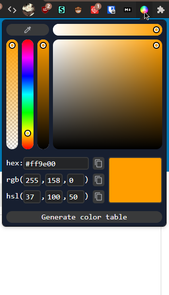
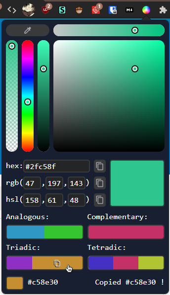
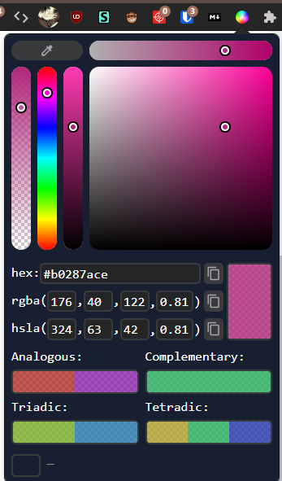
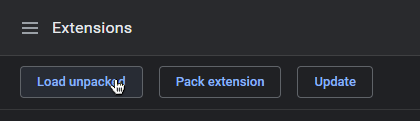

# Bismuth: Color Picker & Eye Dropper

	
	
	

  
## features
- Clean & feature complete color picker (using iro.js & custom logic)
  - Precise X & Y axis adjustment with separates sliders
  - hex(hex8), rgb(a) and hsl(a) output
  -  2 way binding to inputs for hex, rgb(a) and hsl(a)
- Show Analogous, Complementary, Triadic and Tetradic colors
- Quick copy any color to clipboard
- Eye dropper from webpage using EyeDropper API (Chrome 95/Opera 81 or newer)

## installation
### (chrome / chromium)
just clone this repo and load unpacked extension. (you have to enable developer mode)    
  
### firefox version
[Get it on Moziila Addons Store](https://addons.mozilla.org/en-US/firefox/addon/bismuth-color-picker/)
  
## credit
- thanks to [https://github.com/vadymstebakov/eye-dropper](https://github.com/vadymstebakov/eye-dropper) for the original eyeDropper API implementation and the icon
- thanks to [iro.js](https://iro.js.org) for some color picker components